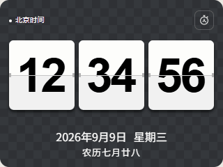
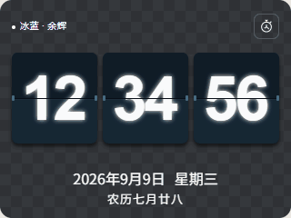
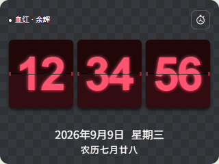

# Cubic 翻页时钟

为 Clocteck Cubic / Holocubic 的 320×240 显示屏制作的 Lua 翻页时钟。

## 七种皮肤与动效预览

以下 GIF 为七种皮肤的界面预览，按正常走时仅翻动秒卡片；顶部保持“北京时间”。棋盘格表示透明区域，不属于应用背景。GIF 由网页原型生成，不代表实机性能；已发布的 v1.0.0 为黑白皮肤版本。

| 黑白 | 纯白 |
| --- | --- |
|  |  |
| 琥珀 | 冰蓝 |
|  |  |
| 紫晶 | 奶油 |
|  |  |
| 血红 | |
|  | |

## 功能与操作

- 左倾保持约 0.8 秒：依次切换七种皮肤。
- 右倾保持约 0.8 秒：显示或隐藏秒；隐藏后放大时分卡片。
- 右倾后在 0.8 秒内回正：切换原版翻页、余辉、机械回弹。快速倾斜的实机手感仍待使用者确认。
- 后方返回操作：退出时钟，回到桌面。
- 自动保存皮肤、翻页模式和秒显示；退出重开恢复选择。
- 显示年月日、星期与农历，日期和“北京时间”保持白字。

首次打开默认黑白皮肤、原版翻页、显示秒。请在设备设置中使用北京时间（UTC+8）并完成校时。

## 安装

适用于带 DevTools 开发工具的 Clocteck Cubic 固件，已测试固件 1.210、320×240 屏幕。以下是手动安装方法，社区商店尚未上架。

1. 让电脑和设备连接同一个 Wi-Fi，在设备配网设置中查看当前 IP。
2. 浏览器打开 `http://设备IP/devtools/`。请使用设备实际地址，不要照抄他人的 IP。
3. 下载本仓库（Code → Download ZIP）并解压。在开发工具文件管理中创建 `/sd/apps/flip-clock/`。
4. 将解压后 `package/` **里面的文件及 skins 子目录**上传到该目录，保留子目录结构。
5. 确认入口位于 `/sd/apps/flip-clock/main.lua`，图标位于同目录的 `main.png`；重新扫描应用，再从设备桌面打开“翻页时钟”。

`/sd` 是固件提供的文件路径，不表示必须插入一张外置 SD 卡。不要只上传 main.lua，不要把整个仓库或 ZIP 文件直接当应用上传，也不要形成 `/sd/apps/flip-clock/package/main.lua` 这样的多余层级。

升级时覆盖应用文件即可，保留设备上已有的 `settings.json`，它保存个人选择。字体和农历数据已包含，无需自行生成。

## 版本与验证

稳定版本为 [v1.0.0](https://github.com/baby-watch/cubic-flip-clock/tree/v1.0.0)，支持黑白两种皮肤。当前开发版本 1.1.0 增加七种皮肤、余辉和机械回弹，已完成设备 API 与正式按键回调检查，外观与快速倾斜手感仍需实机验收。

农历支持 1900—2100 年；已与香港天文台 2024—2030 年共 2,557 天对照表核验。长时间运行和用户报告的偶发黑屏仍在排查，详见 [验证记录](docs/validation.md)。

资源构建、测试与官方文档入口请见 [开发说明](docs/development.md)。

## 许可与社区状态

本项目原创代码采用 MIT 许可；第三方资源单独说明，不受项目 MIT 许可覆盖。

1.0.0 已上传公开仓库 [baby-watch/cubic-flip-clock](https://github.com/baby-watch/cubic-flip-clock)，尚未发送审核邮件或获得社区上架批准。字体内嵌 OFL 授权、源文件哈希、命名独立的子集和版权声明已保存；农历生成工具的 MIT 许可已保留。
